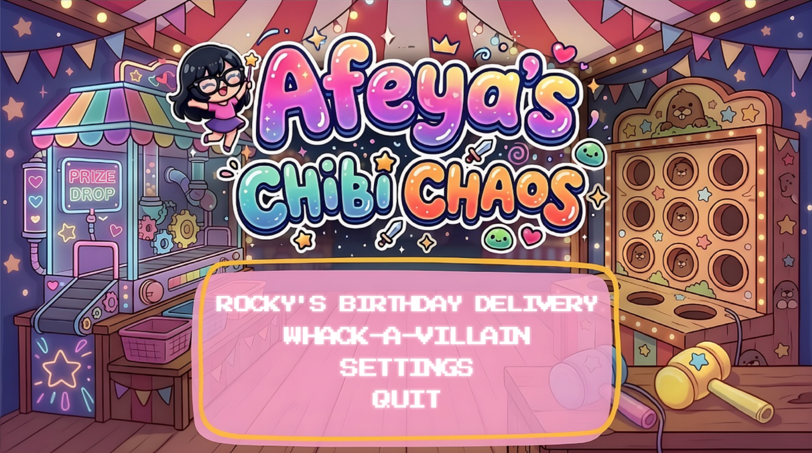
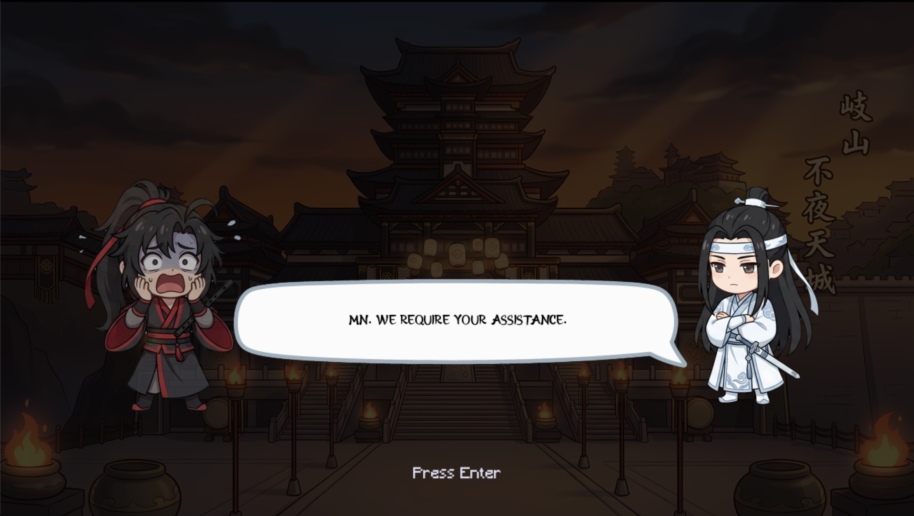
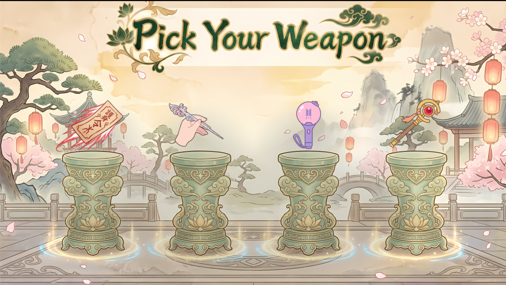
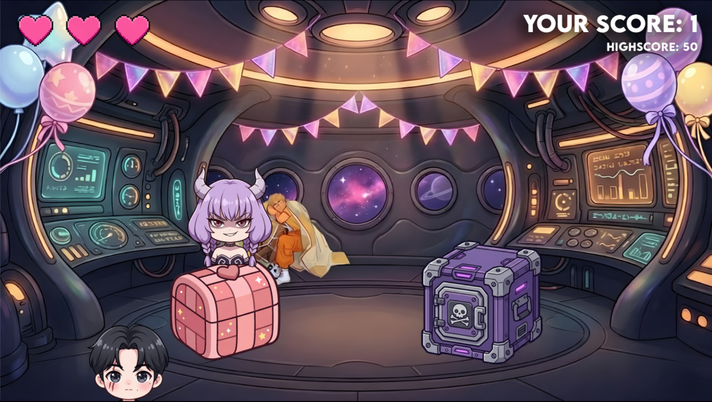
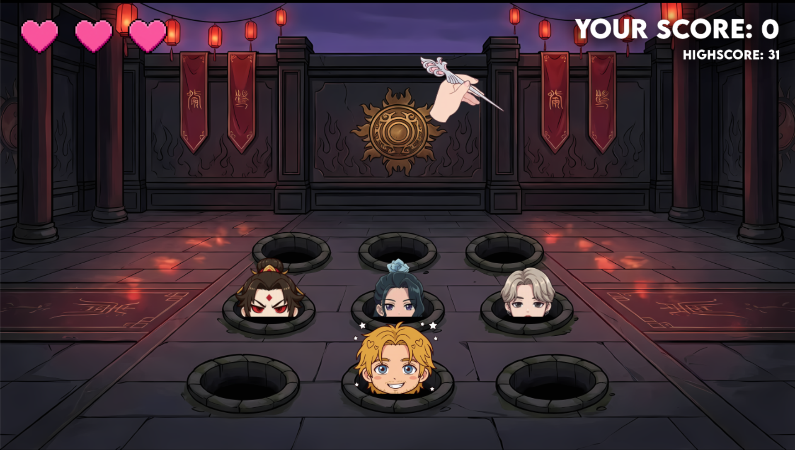
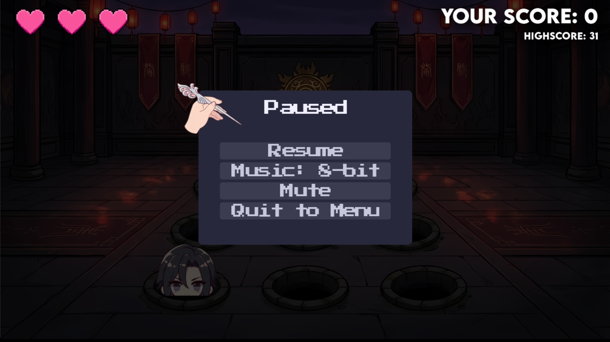
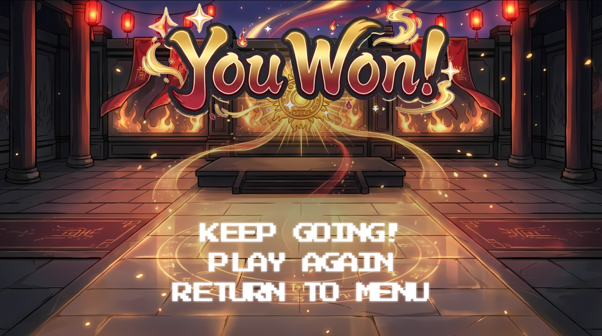

# Afeya's Chibi Chaos

**A birthday-themed desktop party game packed with chibi characters from your favorite fandoms — two mini-games, cinematic cutscenes, and a whole lot of chaos.**

Step into a colorful carnival arcade where every screen is bursting with personality. Whether you're sorting falling chibi heads into love baskets and coffins, or whacking villains with a themed cursor of your choice, *Afeya's Chibi Chaos* is built to be picked up in seconds and played for hours.

From the moment you launch the game, you're greeted by a glowing carnival tent, arcade machines, and a menu that practically dares you *not* to click something. Choose **Rocky's Birthday Delivery**, dive into **Whack-A-Villain**, tweak your settings, or jump straight in — the party starts here.

---

## Download & Install

Ready to play? It takes less than a minute:

1. Download the latest `AfeyaChibiChaos.zip` from the [Releases page](#) *(replace with your release URL)*
2. Extract the zip file anywhere on your computer
3. Double-click `AfeyaChibiChaos.exe` to play

> **Note:** Both `AfeyaChibiChaos.exe` and the `_internal/` folder must stay together in the same directory. Do not move one without the other.

## System Requirements

- **OS:** Windows 10 or later
- **Display:** 1280×720 minimum resolution
- **Dependencies:** None — everything is bundled and ready to go

---

## Story-Driven Cutscenes

This isn't just a collection of mini-games — there's a story to unfold. Before the action kicks off, you'll meet characters from across the fandoms in fully illustrated, interactive cutscenes. Press **Enter** to advance the dialogue and watch the drama (and comedy) unfold.

Expect expressive chibi reactions, atmospheric backgrounds, and dialogue that sets the stage for the chaos ahead. The Whack-A-Villain mini-game alone features an **8-screen animated cutscene** starring Wei Wuxian and Lan Wangji — and a victory dialogue cutscene when you win.

---

## Pick Your Weapon

Before you whack a single villain, you get to choose your cursor — and each one is a love letter to a different fandom. Will you wield an MDZS talisman, Frieren's staff, Maomao's hairpin, or the iconic BTS ARMY Bomb?

Your choice isn't just cosmetic — every cursor comes with its own **animated swing effects** and sparkle particles on every hit. Pick the one that speaks to you and make it yours.

---

## Rocky's Birthday Delivery

**Genre:** Drag & Drop · **Goal:** Score 50 points · **Vibe:** Sci-fi birthday party gone wonderfully wrong

Chibi character heads rain down from the sky aboard Rocky's spaceship! Grab them with your mouse and drop them into the right bin before they hit the floor:

- **Love Basket (left)** — for your favorite heroes
- **Coffin (right)** — for the villains

Sort correctly to rack up points. Reach **50 points** to win — but one wrong drop or missed character costs you a life, and you've only got three hearts to spare.

**What makes it special:**
- Cinematic intro starring Rocky the alien
- Progressive difficulty — speed and spawn rate ramp up the longer you survive
- Reactive bin animations that celebrate (or punish) every drop
- Easter egg dialogue from Rocky if you know where to look
- Confetti celebration when you clinch victory

---

## Whack-A-Villain

**Genre:** Whack-a-Mole · **Goal:** Outscore the villains · **Vibe:** Traditional hall turned arcade showdown

Villains pop up from a **3×3 grid** of holes in a beautifully rendered East Asian hall. Click them fast to whack them and earn points — but watch out, because heroes pop up too, and hitting a hero costs you a life.

The faster you play, the harder it gets. Difficulty scales with your score, keeping every round tense and rewarding.

**What makes it special:**
- 8-screen animated cutscene before the action begins
- 4 themed cursors to choose from (see above!)
- Animated swing effects on every click
- Score-based difficulty scaling that keeps you on your toes
- Sparkle particle effects on every successful hit
- Victory dialogue cutscene and confetti when you win

---

## Customize Your Experience

Hit **Esc** anytime during gameplay to pause and fine-tune your session. Swap between music tracks, mute the audio entirely, or head back to the main menu — all without losing the vibe.

**Music options** (accessible from the main menu and in-game):
- 8-bit chiptune
- NCS
- MDZS
- BTS
- Amaze
- Mute

Whether you want retro arcade energy or something more cinematic, there's a soundtrack for every mood.

---

## Victory Feels This Good

Win a round and the game makes sure you *feel* it. Golden light floods the hall, embers swirl through the air, and you're greeted with a triumphant **"You Won!"** — then choose to keep going, play again, or return to the carnival menu.

Keep pushing for a new high score, or take the win and come back for another round. Either way, the confetti is waiting.

---

## Controls

| Action | Input |
|--------|-------|
| Drag characters | Click & hold + move mouse |
| Whack characters | Click |
| Advance dialogue | Enter |
| Open settings / Pause | Esc (in-game) |

---

## Fandoms Featured

Characters and references from across these worlds make an appearance:

- **Mo Dao Zu Shi** — Wei Wuxian, Lan Wangji, Wen Chao, Su She
- **Frieren: Beyond Journey's End** — Frieren, Stark, Aura, Qual
- **The Apothecary Diaries** — Maomao, Jinshi, Suirei
- **Project Hail Mary** — Rocky, Adrian, Grace
- **BTS** — Jimin, Suga
- **Iron Lung** — Simon

---

Made with love as a birthday gift. Download it, pick your weapon, and dive in — the carnival is open.
